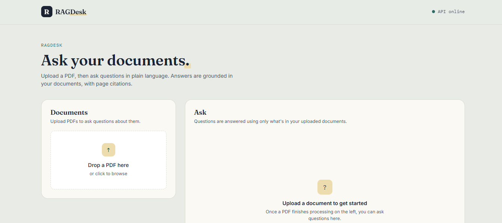
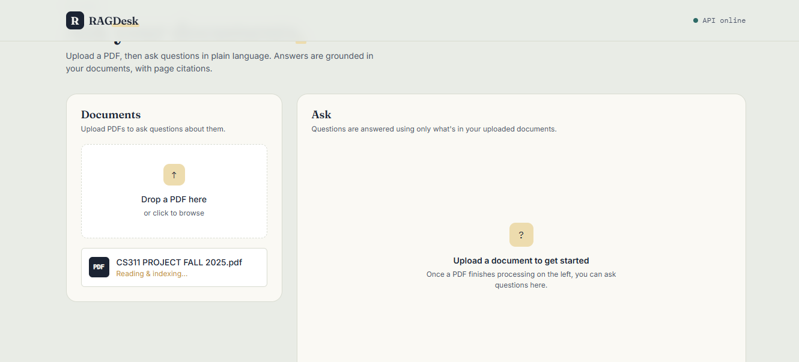

# RAGDesk
 
A document-reading agent with citations — upload a PDF, ask questions, get grounded answers with page-level source citations.
 
Built to demonstrate **LLM + Vector Search + RAG** skills, deployed fully on **Vercel's free tier** as a single Next.js app (frontend + serverless backend, no separate server to host).
 
<p>
  
  
  
  
  
</p>
---
 
## Screenshots
 
### Home Page

 
### Upload Document

 
---
 
## How It Works
 
1. **PDF Upload** — user uploads a PDF through the UI.
2. **Text Extraction** — `unpdf` extracts text page by page.
3. **Chunking** — each page is split into 800-character chunks with 150-character overlap.
4. **Embedding** — chunks are embedded using Google's `gemini-embedding-001` model.
5. **Vector Storage** — embeddings are stored in-memory with cosine similarity search.
6. **Question Answering** — the user's question is embedded, matched against stored chunks, and passed to `gemini-2.5-flash` to generate a grounded answer.
7. **Citations** — the answer includes `[Source N]` tags, shown in the UI as `filename · p.N` chips.
---
 
## Tech Stack
 
- **Next.js 15** (App Router) — fullstack framework, serverless API routes
- **React 19** — UI
- **@google/genai** — Gemini embeddings + chat model
- **unpdf** — serverless-friendly PDF text extraction
- **Vercel** — hosting
---
 
## Getting Started
 
```bash
# 1. Install dependencies
npm install
 
# 2. Add your Gemini API key
cp .env.example .env.local
# then edit .env.local and paste your key from https://aistudio.google.com/apikey
 
# 3. Run the dev server
npm run dev
# open http://localhost:3000
```
 
Upload a PDF, wait for "Ready", then ask questions in the chat panel.
 
---
 
## Deploy to Vercel
 
1. Push this repo to GitHub.
2. Import it at [vercel.com/new](https://vercel.com/new) — Next.js is auto-detected.
3. Add an environment variable:
   - **Key:** `GEMINI_API_KEY`
   - **Value:** your key from [aistudio.google.com/apikey](https://aistudio.google.com/apikey)
4. Click **Deploy**.
---
 
## API Reference
 
| Endpoint | Method | Description |
|---|---|---|
| `/api/health` | GET | Health check |
| `/api/upload` | POST | Upload PDF(s) — extracts, chunks, embeds, stores |
| `/api/ask` | POST | Ask a question — returns answer with citations |
| `/api/retrieve` | POST | Returns raw top-k matching chunks (debugging) |
| `/api/stats` | GET | Returns total chunks stored |
 
---
 
## Project Structure
 
```
ragdesk-vercel/
├── app/
│   ├── api/[...slug]/route.js   # Catch-all API route
│   ├── layout.jsx
│   └── page.jsx
├── components/                  # UI components
├── lib/
│   ├── chunking.js
│   ├── embeddings.js
│   ├── llm.js
│   ├── pdf.js
│   └── vector-store.js
├── assets/                      # Screenshots
├── public/
├── .env.example
├── next.config.mjs
├── package.json
└── vercel.json
```
 